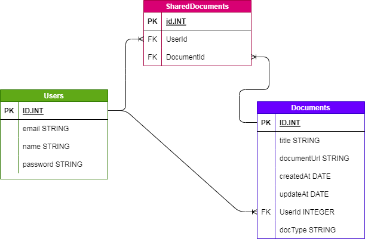
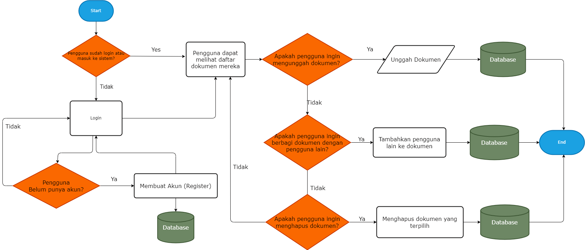

# ShareFlow
A Document management application where users can upload documents and then share with other users, built using NestJs and Prisma, also my first fullstack project that use docker for deployment

### Table Schema Entity Relationship Diagram

<div align="center" >
    
</div>

### Business Process Flowchart



# Document Management Application

This application is a document management system built using NestJs, Prisma and deployed using Docker.

## How to Use

Follow these steps to run this application:

1. Clone this repository:

```bash
git clone https://github.com/raihank43/ShareFlow.git
```

2. Run Docker Compose:

```bash
docker-compose up -d
```

3. After running the above command, Docker will build and run all services defined in docker-compose.yml.

4. Access the application:

```bash
The server runs at http://localhost:3000
The client runs at http://localhost:8080
```

## Configuration

This application requires a Cloudinary URL for uploading documents. You should provide this URL in the CLOUDINARY_URL environment variable in the docker-compose.yml file.

```bash
environment:
  CLOUDINARY_URL: "cloudinary://<your-cloudinary-url>"
```

Replace `<your-cloudinary-url>` with your Cloudinary URL.

# Note

Ensure Docker is installed and running on your machine before running this application.